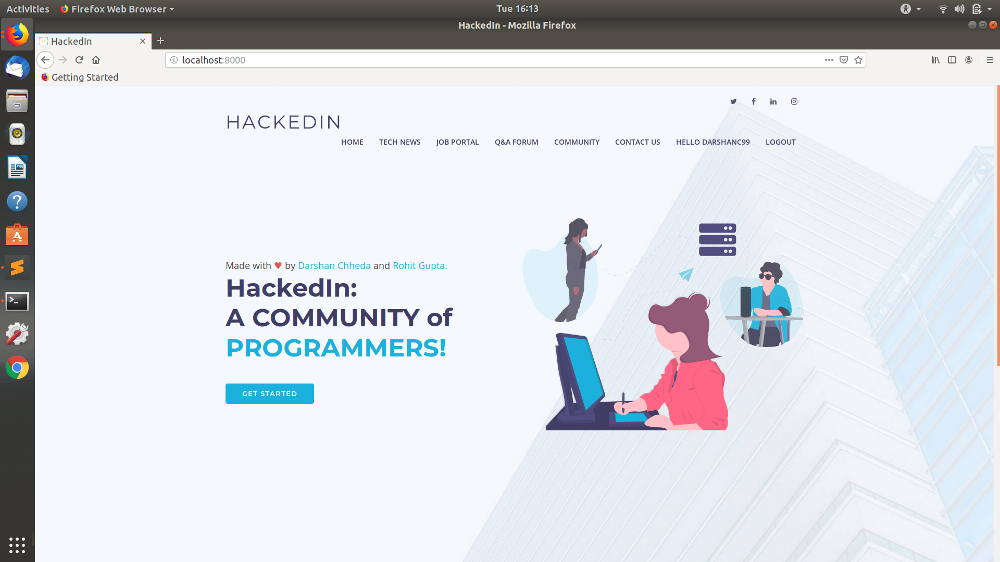
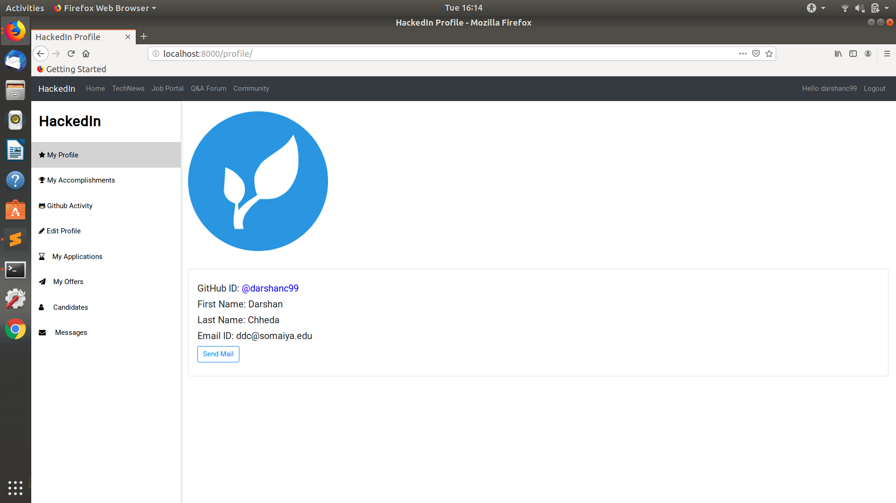
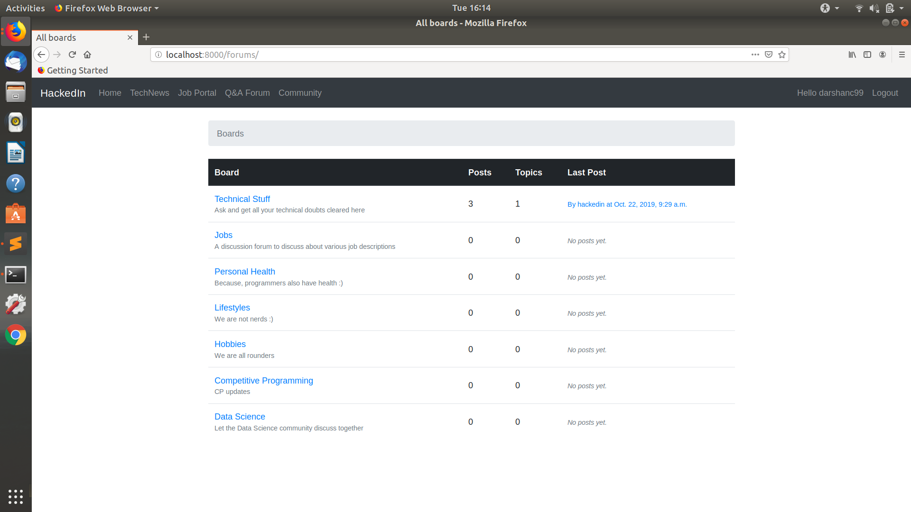
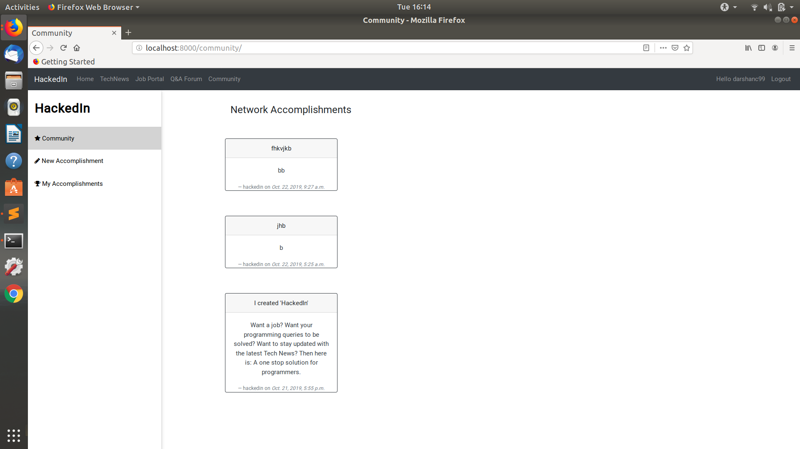
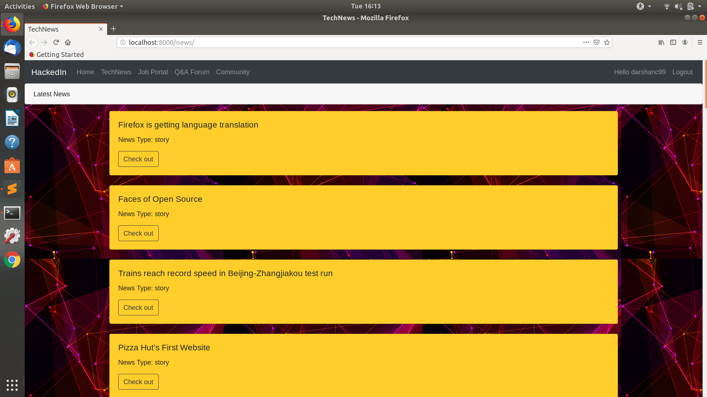

<div align="center">	
	<h1>HackedIn :computer:</h1>

[](http://hits.dwyl.io/darshanc99/HackedIn)
[](https://github.com/ellerbrock/open-source-badges/)
[](https://www.djangoproject.com/)

</div>

# HackedIn
## Motivation: 
To create a one stop platform for programmers where they can interact, stay updated and make the programmer community grow together.
#### Features:
* Keeps you updated with the latest tech news.
* Helps you find employees/project collaborators/interns for your projects.
* Helps you land up on jobs/internships.
* Messaging feature for Employer-Employee.
* A discussion forum that helps you solve your queries.
* A community dashboard that lets you know what the programming community is upto.
* A github dashboard for your account.
* Includes mobile view.

------------------------------------------
#### Future Developments:
* Users be able to send and accept connection requests with the other members of the community.

------------------------------------------

#### This project still has scope of development, so you can also contribute to this Project as follows:
* [Fork](https://github.com/darshanc99/HackedIn) this Repository.
* Clone your Fork on a different branch:
	* `git clone -b <name-of-branch> https://github.com/darshanc99/HackedIn.git`
* After adding any feature:
	* Goto your fork and create a pull request.
	* We will test your modifications and merge changes.
	
------------------------------------------


<div align="center">

<h3 > HackedIn as web-app  </h3>
<br>


<br>



<br>



<br>



<br>

<br>


<br>

</div>

------------------------------------------
## Techstack used:
- Frontend: HTML,CSS,JS, Bootstrap4
- Backend: Python
- Framework: Django
- Dependencies: HackerNews API and Github API

------------------------------------------

### Admin Panel
**username** : hackedin<br/>
**password** : 123456

------------------------------------------

### Installation:
- Windows User:<br/>
-- python 3.7+<br/>
-- pip3.*<br/>
-- django==2.2.3 -> ```pip install django```<br/>
-- django-crispy-forms==1.7.2 -> ```pip install django-crispy-forms```<br/>
-- pillow==6.1.0 ->```pip install pillow```<br/>
- Linux User:<br/>
-- ```pip3 install -r requirements.txt```

------------------------------------------

### To Do:
* [] Update the installation list in the README.md file
